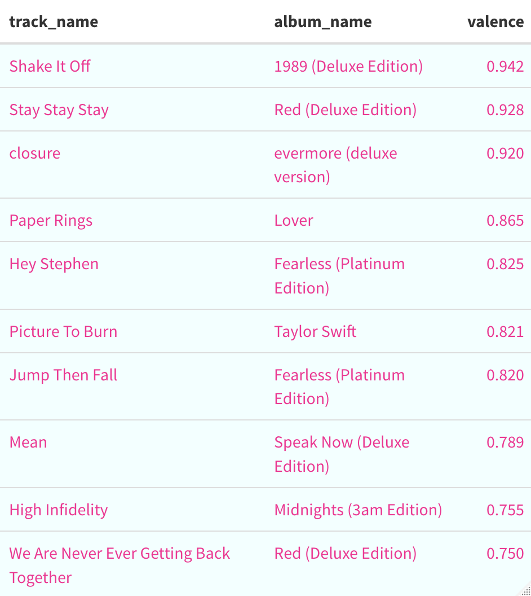
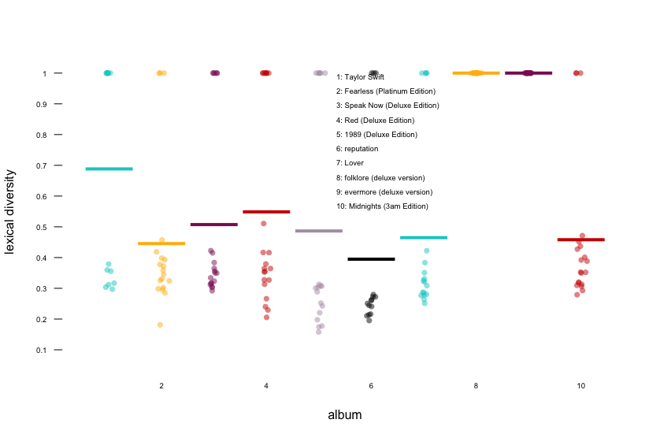
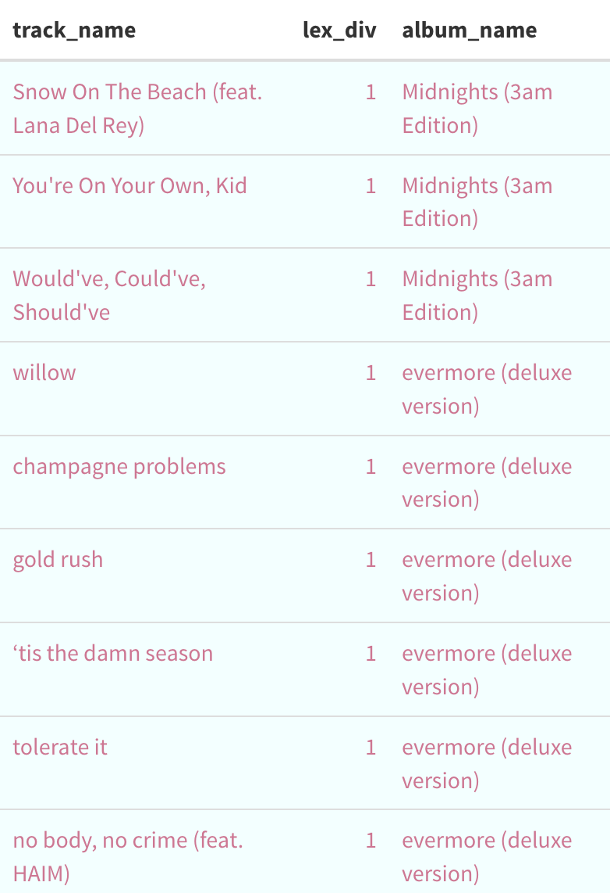
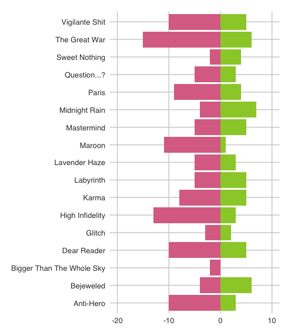
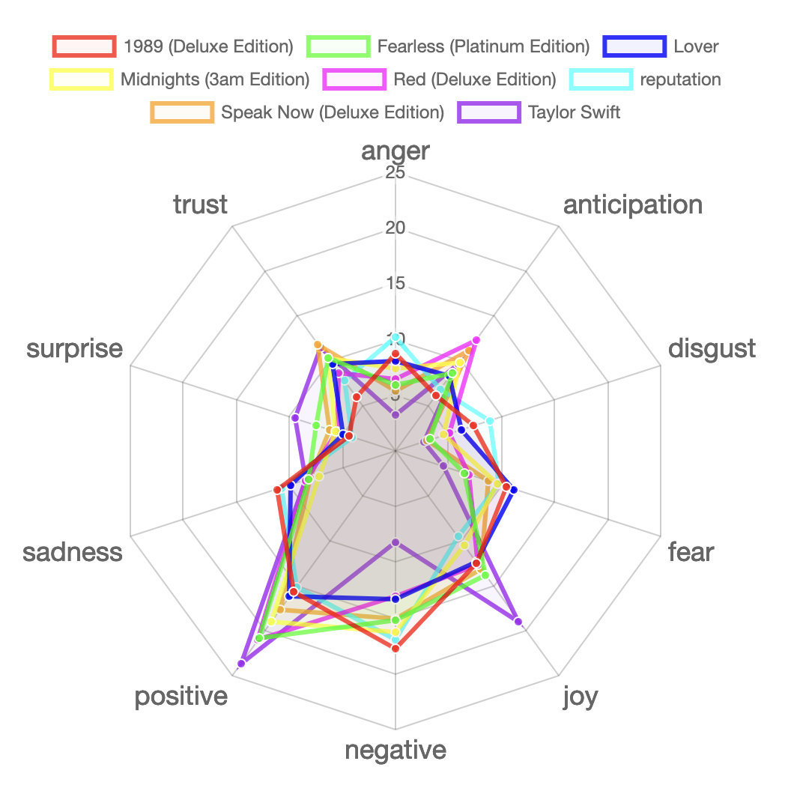

```{r setup, include=FALSE}
knitr::opts_chunk$set(
  echo = TRUE, 
  warning = FALSE, 
  message = FALSE, 
  dpi = 300)
```
# Introduction
<font size = "4"> Taylor Swift is an incredibly talented singer, songwriter, and actress who has captured the hearts of fans all over the world. Her powerful lyrics, captivating voice, and strong personality have made her one of the most influential artists of our time. As a big fan of Taylor Swift, I wanted to practice my scraping skills to explore her music and do data analytics. To achieve this, I decided to scrape data from two sources: Spotify and Genius. </font>


# Data collection
<font size = "4"> Using the Spotify API, I gathered information on Taylor Swift's entire discography, including album names, track titles, and popularity rankings. Then I used the Genius API to scrape the lyrics for each track. By combining the data from both sources, I was able to gain a deeper understanding of Taylor Swift's music and the themes and ideas that inspire her songwriting. </font>

```{r data, include = FALSE}
library(readr)
library(rio)
library(ggplot2)
library(tidyverse)
library(Hmisc)
library(broom)
library(ggpubr)
library(corrplot)
spotify_genius <- read_csv("../data/spotify_genius.csv")
```
Combined dataset `spotify_genius` contains data for each track out of 10 studio albums of my interest.
```{r}
# Browse the dataset
head(spotify_genius)
```
# Musical features analysis

## Acousticness

*This value describes how acoustic a song is. A score of 1.0 means the song is most likely to be an acoustic one. I build a ridge plot to produce an overview of acousticness and check on my own assumption which album has the biggest value.*

<font size = "4"> Folklore and Evermore, two of Taylor Swift's most popular albums, stand out for their high acousticness. This may be due to Taylor's shift towards the indie/alternative genre during the pandemic, which often uses acoustic instruments and a stripped-down sound. The albums showcase Taylor's versatility and willingness to experiment with new styles. (And they are my personally favourite albums as well) </font>

## Valence
*A measure from 0.0 to 1.0 describing the musical positiveness conveyed by a track. Tracks with high valence sound more positive (e.g. happy, cheerful, euphoric), while tracks with low valence sound more negative (e.g. sad, depressed, angry).*

### Albums


<font size = "4"> The Lover album stands out for having the highest mean valence among Taylor Swift's albums. This is especially interesting considering her previous album, Reputation, had the lowest overall score. The contrast between these two albums may be due to the personal changes in Taylor's life that influenced her music during these periods. The Lover album is characterized by a more positive and romantic tone, while Reputation reflects a darker and more cynical outlook. This demonstrates Taylor's ability to adapt her music to reflect her personal experiences and emotions. </font>

### Tracks


<font size = "4"> Well, well, well, look who's got the biggest valence overall! It's none other than infectious hit "Shake It Off." Who can resist dancing to that catchy tune? It's been played on every radio station and dance floor across the world!

But wait, hold up a minute. We've got an outlier in the house. The closure track is really throwing us for a loop here. It's not exactly a happy-go-lucky tune, and it's not exactly winning any awards for its lyrics. But  who are we to argue with Spotify's data? The numbers don't lie, even if our ears are a little confused. </font>

## Danceability


<font size = "4"> When we take a closer look at the danceability scores, it's clear that Taylor's upbeat and catchy tunes are what really get people moving. Lover, with its infectious chorus and playful beats, is a prime example of this. Reputation, while not as cheery as Lover, still manages to pack a punch with its energetic rhythms.

But let's not forget about Folklore and Evermore. These albums may not be the go-to choice for a dance party, but they have their own unique charm. The acoustic and raw nature of these albums allows for a more introspective and emotional listening experience. These albums capture Taylor's songwriting talent and show her ability to experiment with different genres and sounds.

Overall, it's clear that Taylor Swift is a force to be reckoned with when it comes to music. She has the ability to make us dance, sing along, or just sit back and reflect on life. It's no wonder why she's one of the biggest names in the industry today. </font>

# Sentiment analysis

<font size = "4"> Taylor Swift is widely known for her ability to capture the essence of love in her music. From the early stages of her career, she has explored different facets of love, be it the exhilaration of a new romance, the heartbreak of a failed relationship, or the joys of true companionship. Her ability to write about love in a relatable way has earned her a massive fan base around the world. </font>


```{r, echo=FALSE, out.width='1000px', out.height='800px'}

```

<font size = "4"> Using sentiment analysis, I analyzed the lyrics of her songs and created a word cloud that showed the most common words used in her discography. It was no surprise that the most prominent word was "love". This finding reinforces the fact that love has been a central theme throughout her career, and her exploration of this theme has been a key factor in her success.

Personally, as a fan of Taylor Swift, I appreciate the way she explores the topic of love in her music. Her ability to articulate complex emotions and experiences related to love has resonated with me and many others. It's no wonder that her music has become the soundtrack to many people's love lives. </font>

## Lexical diversity

### Albums

<font size = "4"> Lexical diversity means the variety of words used in a text, and it can be measured by the number of different words used in relation to the total number of words. In the context of song lyrics, it refers to how many unique words are used in the lyrics of a particular song. </font>

*A score of 1.0 means the song is very diverse, a score of 0.0 - least diverse. I build a pirate plot to produce an overview of diversity in albums and check on my own assumption which album has the biggest value.*

```{r, echo=FALSE, out.width='800px', out.height='600px'}

```
*Dots represent each song in album and lines represent mean value for each album.*
<font size = "4"> When analyzing the lexical diversity of Taylor Swift's albums, it becomes apparent that there are two significant outliers: "Folklore" and "Evermore." This is not surprising, as these two albums are widely regarded as *masterpieces* in terms of storytelling and songwriting.

Throughout her career, Taylor Swift has grown and evolved as an artist, and these albums represent the culmination of her artistic journey. The lyrics in "Folklore" and "Evermore" showcase a remarkable depth and complexity, with a rich tapestry of words and phrases that capture the listener's imagination.

It's no wonder that these albums have stood out from the rest of her discography in terms of lexical diversity. Swift's ability to weave intricate and captivating narratives through her lyrics is a testament to her skill as a songwriter and her dedication to her craft. </font>


### Songs

<font size = "4"> It's not just albums that can be analyzed for lexical diversity - individual tracks can also be studied to see which songs stand out in terms of their use of language. When doing so, it's fascinating to see which songs emerge as the "champions" in this category. </font>

```{r, echo=FALSE}

```

<font size = "4"> Upon conducting such an analysis, the results can be both interesting and, to some extent, expected. In the top 10 tracks with the highest lexical diversity, it's notable that three of them come from the album "Midnight" and an astounding six of them come from "Evermore." The richness and complexity of her lyrics in these tracks showcase her mastery of the art form and highlight her continued growth and evolution as an artist. 

I mean, just *look* at the bridge for "Champagne problems": </font>

```{r, echo=FALSE, out.width='600px', out.height='800px'}
knitr::include_graphics("https://i.pinimg.com/originals/da/ab/c8/daabc854029cdf8ba4e3f57257cc8ade.jpg")
```

<font size = "4"> Outstanding! </font>

## Bing analysis

<font size = "4"> In the next part of my analysis, I focused on the songs from Taylor Swift's "Midnight" album and conducted a sentiment analysis using the Bing lexicon. This allowed me to examine the emotional tone of each song and see how they compared to one another.

The Bing lexicon is a pre-built sentiment analysis tool that assigns a positive or negative sentiment score to words based on their association with positive or negative sentiment in general usage. By analyzing the sentiment of each word in a given text and summing up the scores, we can get an overall sentiment score for the text.

Using this approach, I was able to generate sentiment scores for each song on the "Midnight" album and compare them to each other to get a sense of how the album's overall emotional tone is distributed across its tracks. The results of this analysis shed light on the ways in which Taylor Swift uses language to convey different moods and emotions throughout the album. </font>

```{r, echo=FALSE}

```

<font size = "2"> *On the left:all songs from "Midnights" album. Pink colour shows negative score, green colour shows positive score* </font>

<font size = "4"> Analyzing the sentiment of song lyrics can be challenging due to the use of metaphors and the influence of musical production on the overall emotional tone. In my analysis of Taylor Swift's "Midnight" album, I employed the Bing lexicon to generate sentiment scores for each song. While these scores provide a rough approximation of the emotional content of the lyrics, they do not capture the full complexity of Swift's use of language and the impact of musical production on the listener's emotional response.

Nonetheless, sentiment analysis can still be a valuable tool for understanding the emotional content of text. When combined with close reading and musical analysis, sentiment analysis can provide insights into the ways in which language and music work together to create meaning and evoke emotions in listeners. In the case of Taylor Swift's music, her clever use of language and her ability to combine positive and negative sentiments in unexpected ways contribute to the emotional depth and complexity of her songs.</font>

## NRC analysis

<font size = "4"> In contrast to the Bing lexicon, the NRC lexicon categorizes words into eight additional emotional categories including joy, anticipation, trust, surprise, sadness, anger, disgust, and fear. To explore how Taylor Swift's lyrics across albums compare in terms of these eight emotions, I created a radar chart in my final visualization for this post.
 </font>

```{r, echo=FALSE}

```
<font size = "4"> Based on the analysis of the radar chart, it can be observed that the emotional content in Taylor Swift's albums varies, but there is a tendency towards positivity throughout her discography. </font>

# Conclusion 

<font size = "4"> The analysis conducted using Spotify and Genius API provided valuable insights into Taylor Swift's music. By using measures for musical features and sentiment analysis, we gained a deeper understanding of her discography. While it's difficult to speak about art purely in terms of statistics, diving into this topic was an interesting and enjoyable experience. Overall, the analysis highlighted Swift's focus on love and relationships throughout her music, as well as her evolving sound over the years. It's clear that she has a dedicated fan base that connects with her music on a deep emotional level, and this analysis helped shed light on why her music resonates with so many people. </font>
